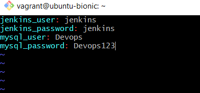
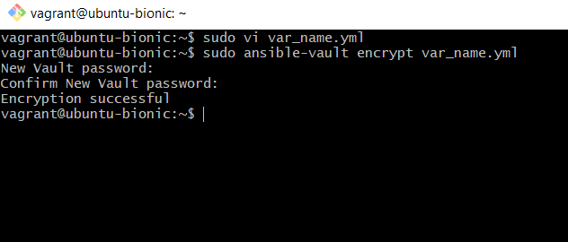
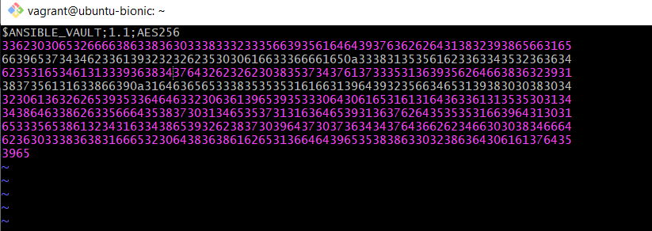
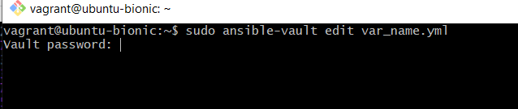
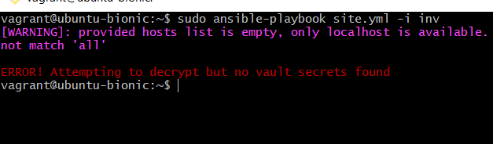
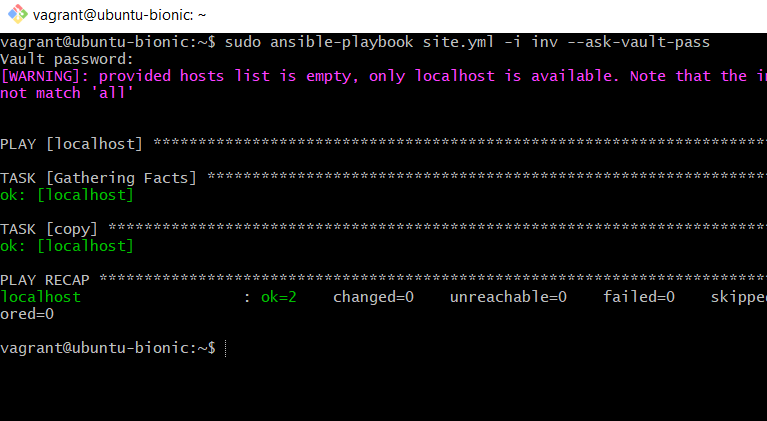
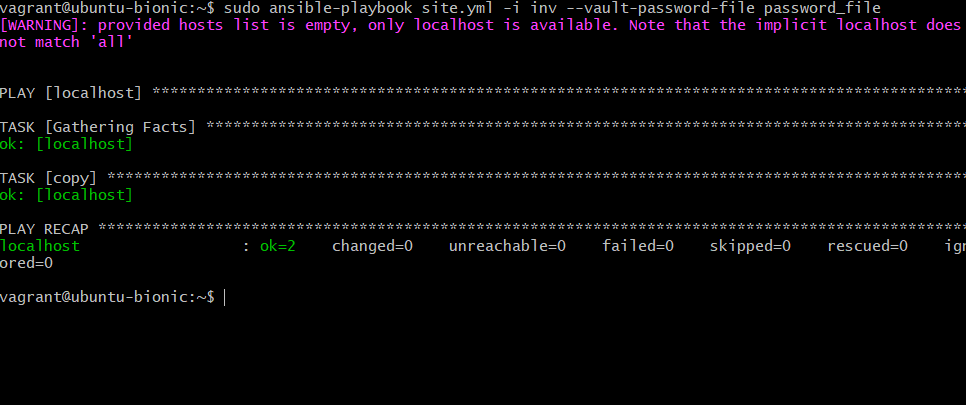

# ansible-vault

Reference: [Ansible-Vault-Docs]((https://docs.ansible.com/ansible/latest/user_guide/vault.html))

Ansible Vault is a feature of ansible that allows you to keep sensitive data such as passwords or keys in encrypted files, rather than as plaintext in playbooks or roles.


### Example File: 
* var_name.yml



### Encryption:
In order to encrypt the file var_name.yml , we can run the following command:

```ansible-vault encrypt var_name.yml```

You will be prompted to enter a new password and confirm it. This is the password you will use for all the further steps.



You can try opening the file now and you will see something like this:



### Edit:
In order to edit an encrypted file var_name.yml , we can run the following command:

```ansible-vault edit var_name.yml```

This will prompt us for the password we entered while encrypting the file:



### Decryption:
In order to decrypt the file var_name.yml , we can run the following command:

```ansible-vault decrypt var_name.yml```

This will prompt us for the password we entered while encrypting the file. Once we enter the correct password, it will convert the file back to plaintext.

### Running a playbook with an encrypted var file:

If we directly try to run a playbook which requires an encrypted file, we will get an error message:



You can run the playbook site.yml by:

1. Prompt for an interactive password: 

    ```ansible-playbook site.yml -i inv --ask-vault-pass```

    This is prompt you for the password like before.
    
    

2. Pass in a password file which contains the password stored as one line in a new file. 
    
    When using this flag, ensure permissions on the file are such that no one else can access your key
    
    First create a new file password_file. 

    Next add the password entered above as a single line in the file.

    
    
    Now run the command,

    ```ansible-playbook site.yml -i inv --vault-password-file /path/to/my/vault-password-file```

    

    You can also set ANSIBLE_VAULT_PASSWORD_FILE environment variable
    ```ANSIBLE_VAULT_PASSWORD_FILE=~/.vault_pass.txt```
    Ansible will automatically search for the password in that file.
